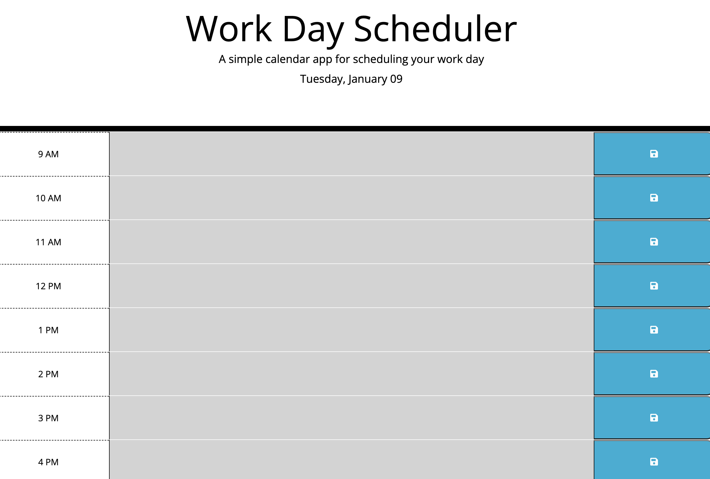

# work-day-scheduler

## Description

This week’s challenge is to create a simple calendar application that allows a user to save events for each hour of the day by modifying starter code. This app will run in the browser and feature dynamic HTML and CSS code powered by jQuery.

## Table of Contents

- [User Story](#user-story)
- [Acceptance Criteria](#acceptance-criteria)
- [Usage](#usage)
- [Credits](#credits)
- [License](#license)

## User Story

AS AN employee with a busy schedule
I WANT to add important events to a daily planner
SO THAT I can manage my time effectively

## Acceptance Criteria

The app should:

* Display the current day at the top of the calender when a user opens the planner.
 
* Present time blocks for standard business hours when the user scrolls down.
 
* Color-code each time block based on past, present, and future when the time block is viewed.
 
* Allow a user to enter an event when they click a time block

* Save the event in local storage when the save button is clicked in that time block.

* Persist events between refreshes of a page

## Usage

Link to deployed application - https://jakewshenry.github.io/work-day-scheduler/

 

## Credits

This project was completed as part of an edX BootCamp coding challenge.

edX module slides - https://bootcampspot.instructure.com/courses/5076/modules

GitHub Pages README: https://coding-boot-camp.github.io/full-stack/github/professional-readme-guide

MDN If else statements - https://developer.mozilla.org/en-US/docs/Web/JavaScript/Reference/Statements/if...else

MDN Local Storage - https://developer.mozilla.org/en-US/docs/Web/API/Window/localStorage

Day JS - https://day.js.org/docs/en/display/format

## License

This project is licensed under the MIT License.